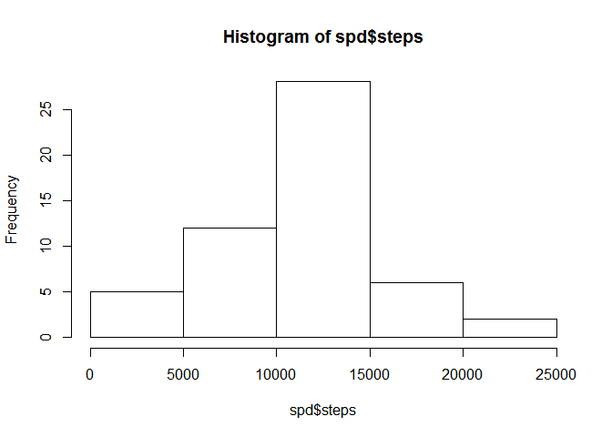
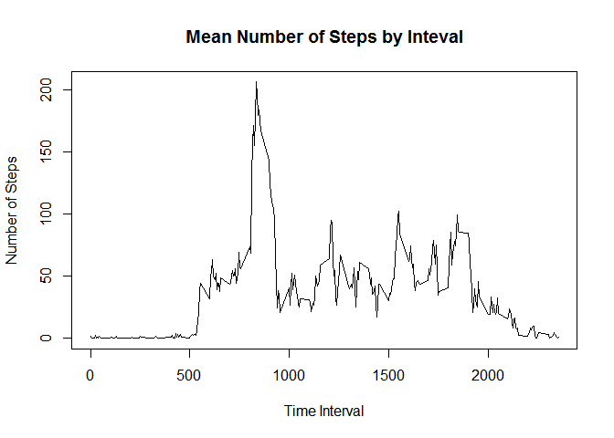
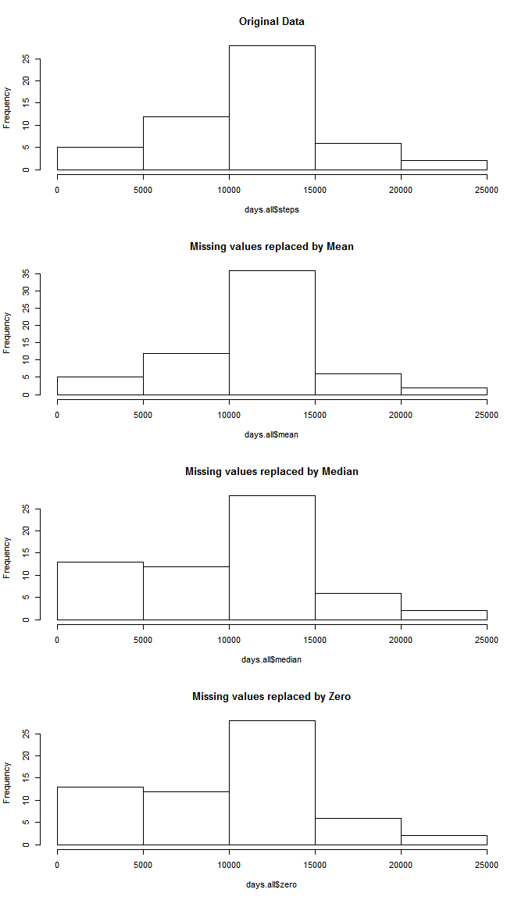
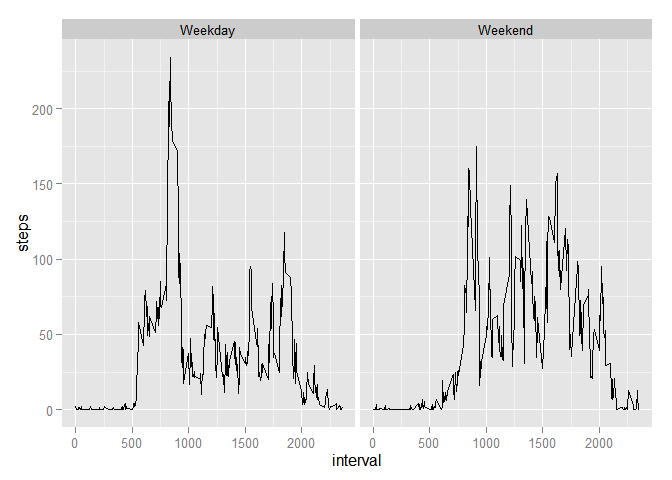

# Reproducible Research: Peer Assessment 1


## Loading and preprocessing the data
Download [Activity Monitoring Data](https://d396qusza40orc.cloudfront.net/repdata%2Fdata%2Factivity.zip) into your current directory.


This should create a zip file called 'repdata-data-activity.zip' in your current directory.


### Get the Raw Data
The raw data is a .csv file contained in a zip file. So first upzip the downloaded file to get the .csv file.

```r
unzip("repdata-data-activity.zip")
```
This leaves a file called activity.csv in the current directory

### Read up the raw data

First, set up the column classes, then read the csv file into a data.frame named 'df'.

```r
colclasses=c("integer", "Date", "integer")
df = read.csv("activity.csv", colClasses = colclasses)
```


## What is mean total number of steps taken per day?

### Total number of steps taken per day
The total number of steps taken each day can be computed by consolidating all of the interval observations within each day.
The 'aggregate' function will do this.
Since we want the **total** number of steps for a given day, the aggregation function will be 'sum'.

```r
spd <- aggregate(steps ~ date, data=df, sum)
```

### Histogram of the total number of steps taken each day

Below is a histogram showing the frequency counts on the daily total number of steps.


```r
hist(spd$steps)
```

 


### Mean and median of the total number of steps taken per day
The R 'summary' function will do this for us:

```r
summary(spd$steps)[c("Mean", "Median")]
```

```
##   Mean Median 
##  10770  10760
```

## What is the average daily activity pattern?

The figure below shows the mean number of steps for each 5-minute interval throughout the day.  As one would expect, not many steps taken after 10 PM (hour 22) and before 5AM (hour 5). The code that produced this is:


```r
spint <- aggregate(steps ~ interval, data=df, mean)
plot(spint$interval, spint$steps, type="l",
     main="Mean Number of Steps by Inteval",
     ylab = "Number of Steps",
     xlab = "Time Interval")
```

 

To calculate the maximum number of steps and the interval in which those maximum number of steps occurred, use the following R code:


```r
ndx <- which.max(spint$steps)
int <- spint$interval[ndx]
```

As the plot shows, the maximum number of steps of 206 occurs at interval 835.

## Imputing missing values
The raw data contains 2304 missing values.
In this section, we'll explore the impact  of various
methods of replacing the missing values on mean and median steps per day summary statistics.
We'll examine the impact of these three methods of supplying missing data:


1. Substitute the mean value for the interval
2. Substitute the median value for the interval
3. Substitute 0

Since some of the days have no values for any interval, the means and medians will need to be calculated across the interval as opposed to across the day.

First, we'll make a data.frame that has a row for each time inteval and columns for the values to be substituted, i.e., mean, median and zero.


```r
medians <- aggregate(steps ~ interval, data=df, median)
if(any(is.na(medians))) stop("didn't get a median for an interval")

means   <- aggregate(steps ~ interval, data=df, mean)
if(any(is.na(means))) stop("didn't get a median for an interval")

#build a data.frame of values to be substituted in
subvalues <- merge(means, medians, by="interval")

# 12 5-minute intervals within an hour so there should be 24*12 rows
if (nrow(subvalues) != 24*12) stop ("missing a value for an interval")

#fix up the column and row names of the substitute value data frame
colnames(subvalues)  <- c("interval","mean","median")
row.names(subvalues) <- subvalues$interval

#stick on the zero value column
subvalues$zero = 0
```

Second, create a data frame that is a copy of the original with additional columns that have the missing values replaced.


```r
ndf <- df
na.index = which(is.na(ndf$steps))

#initialize the new columns of ndf with the steps values (including na's)
ndf$mean   <- ndf$steps
ndf$median <- ndf$steps
ndf$zero   <- ndf$steps

#now stuff in the substitute values for the missing values
meth <- c("mean", "median", "zero")
for (i in seq_along(meth)) {
        ndf[na.index, meth[i]] <- subvalues[as.character(ndf$interval[na.index]), meth[i]]
}
```
Now create summary data.frames.  This is a little tricky because the aggreate function will omit rows for which there is no data.

```r
#daily summaries in two passes and merge them together
days.nonas<- aggregate(cbind( mean, median, zero)~date,data=ndf, sum)
days      <- aggregate(steps~date,                     data=ndf, sum)
days.all  <- merge(days, days.nonas,all.x=T, all.y = T)
```

###Histograms
The charts below show the effect on the frequency counts of the different data filling techniques.

```r
par(mfrow=c(4,1))
hist(days.all$steps, main="Original Data")
hist(days.all$mean, main="Missing values replaced by Mean")
hist(days.all$median, main="Missing values replaced by Median")
hist(days.all$zero, main="Missing values replaced by Zero")
```

 

###Mean and Median Summaries
The table below shows the impact of the different missing value filling techniques on the mean and median summary statistics


```r
library(xtable)
summary <- data.frame(technique=c("Original Data",meth), row.names = NULL,
                      Mean=apply(days.all[,c("steps",meth)],2,mean,na.rm=T),
                      Median=apply(days.all[,c("steps",meth)],2, median, na.rm=T))
print(xtable(summary),type = "html")
```

<!-- html table generated in R 3.2.0 by xtable 1.7-4 package -->
<!-- Sun Dec 20 16:18:50 2015 -->
<table border=1>
<tr> <th>  </th> <th> technique </th> <th> Mean </th> <th> Median </th>  </tr>
  <tr> <td align="right"> 1 </td> <td> Original Data </td> <td align="right"> 10766.19 </td> <td align="right"> 10765.00 </td> </tr>
  <tr> <td align="right"> 2 </td> <td> mean </td> <td align="right"> 10766.19 </td> <td align="right"> 10766.19 </td> </tr>
  <tr> <td align="right"> 3 </td> <td> median </td> <td align="right"> 9503.87 </td> <td align="right"> 10395.00 </td> </tr>
  <tr> <td align="right"> 4 </td> <td> zero </td> <td align="right"> 9354.23 </td> <td align="right"> 10395.00 </td> </tr>
   </table>


## Are there differences in activity patterns between weekdays and weekends?

Yes. As the figure below illustrates, the test subject is more active on weekends than on weekdays.


```r
#classify the days in the raw data.frame as either weekend days or weekdays
wd <- weekdays(df$date)
df$daytype <- factor(ifelse(wd=="Saturday" | wd=="Sunday", "Weekend", "Weekday"))

#consolidate the data by daytype and interval
spint <- aggregate(steps ~ daytype+interval, data=df, mean)

#plot it out
library(ggplot2)

p=ggplot(spint, aes(x=interval, y=steps))+facet_wrap(~ daytype)+geom_line(stat = "identity")
print(p)
```

 


